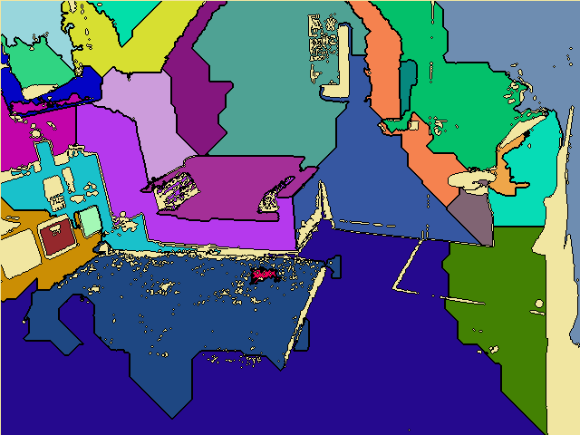

# M1-Analyse image

## Students
- SEN Abdurrahman (p1510824)
- DESBIAUX Arthur (p2006393)
- VADUREL Benjamin (p2000154)

## Installation

### Install script
/!\ The install script only work on linux distrib.

Once you pulled this GIT repository, you have to get into the project's root and execute the script ```install.sh```. It will download the opencv2 library and setup the development environnement for you.

```sh
#In the project's root (sudo recommanded)
sudo sh install.sh
```
The execution may take few minutes.

### Compilation and execution
Once the script finished its execution, you should find the code in the ```src``` repository. To compile it you have to use these two command lines : 

```sh
cd src;
make;
make -DCMAKE_BUILD_TYPE=Debug; #for debug
```

You'll get an executable named ```main``` that you can launch with :

```sh
./main image; #to process an image
./main video; #to process a video
```

#### Parameters

The application is using several parameters defined in ```Settings.hpp```.

```INPUT_IMAGE_PATH``` : path to the folder where the image is  
```INPUT_IMAGE_FILE``` : filename of the image

```INPUT_VIDEO_PATH``` : path to the folder where the video is  
```INPUT_VIDEO_FILE``` : filename of the video

```NUMBER_OF_REGIONS``` : Number of seeds before region grow

```PIXEL_COLOR_SIMILARITY_THRESHOLD```: Define threshold used by the similitary criteria for the region growing
```REGION_COLOR_SIMILARITY_THRESHOLD``` : Define threshold used by the similarity criteria for merging regions.

```MAX_FRAME_COMPUTED_AT_ONCE``` : Define the size of the thread pool when computing a video. (/!\ Increasing this parameter increases RAM/CPU consumption, be careful, increasing too much may cause performance issue !)

```DRAW_ONLY_BORDERS```: If you want to show only the borders of the regions (true)

### Result

If you give no argument to the program, an error meessage will appear.

#### Computing an image

When executing the program using ./main image, a window should appear with the computed image. Here's an example using ```room.png```, your results may differ as seed planting is random.

Test images can be found at ```src/Samples/Images/```.



#### Computing a video

When executing the program using ```./main video```, as the computing progress, you should see the progress percentage. Once the computation finished, a file containing the computed video should be created at the displayed location (starting by the root of the repo) in the console (by default : ```src/Samples/Video/register.avi```). 

Test videos can be found at ```src/Samples/Video```.

### References
- OpenCV 2 Install guides used to code the install script :
  - [OpenCV 2 Official Documentation](https://docs.opencv.org/4.x/d7/d9f/tutorial_linux_install.html)
  - https://www.geeksforgeeks.org/how-to-install-opencv-in-c-on-linux/
